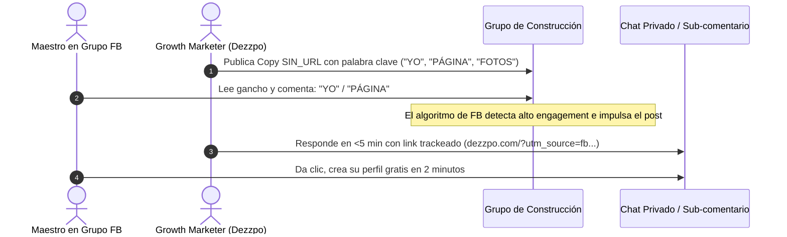

# 🏗️ Manual de Copys para Campaña de Growth en Facebook — Dezzpo

> **Documento Estratégico y Biblioteca Táctica de Copywriting**  
> **Target**: Maestros de obra, contratistas, albañiles, pintores, electricistas, plomeros y profesionales de remodelación/acabados en Colombia.  
> **Plataforma**: Dezzpo (`dezzpo.com`) — *El LinkedIn y Vitrina Digital para los Profesionales de la Construcción*.

---

## 1. Resumen Ejecutivo & Propuesta de Valor

### El Dolor Central
La gran mayoría de los trabajadores de la construcción y técnicos independientes dependen exclusivamente del **"voz a voz"** o envían fotos desordenadas por WhatsApp. Carecen de un portafolio web indexable, sufren de invisibilidad digital fuera de su círculo inmediato y son vulnerables a la intermediación no regulada.

### La Solución Dezzpo
Dezzpo brinda a todo maestro o especialista un **micrositio profesional gratuito** donde puede:
- Mostrar fotos de sus obras y acabados de manera organizada.
- Publicar sus servicios y áreas de cobertura geográfica.
- Recibir cotizaciones y llamadas directas en su WhatsApp sin intermediarios ni comisiones.
- Ganar estatus y reputación profesional mediante calificaciones y certificados.

---

## 2. Marco Metodológico y Taxonomía (3 Ejes)

Cada mensaje de la biblioteca está estrictamente clasificado bajo tres ejes complementarios:

```
                      ┌─────────────────────────────────────────┐
                      │          BIBLIOTECA DE COPYS            │
                      └────────────────────┬────────────────────┘
                                           │
         ┌─────────────────────────────────┴─────────────────────────────────┐
         ▼                                                                   ▼
┌──────────────────────────┐                               ┌──────────────────────────┐
│  1. OBJETIVO: EXPOSICIÓN  │                               │    2. OBJETIVO: VENTAS   │
│  (Vitrina & Posicionam.) │                               │  (Clientes & Oportunid.) │
└────────────┬─────────────┘                               └────────────┬─────────────┘
             │                                                          │
    ┌────────┴────────┬────────────────┐                       ┌────────┴────────┬────────────────┐
    ▼                 ▼                ▼                       ▼                 ▼                ▼
┌───────────┐   ┌───────────┐   ┌──────────────┐         ┌───────────┐   ┌───────────┐   ┌──────────────┐
│  INTRIGA  │   │ BENEFICIO │   │  CONVERSIÓN  │         │  INTRIGA  │   │ BENEFICIO │   │  CONVERSIÓN  │
└─────┬─────┘   └─────┬─────┘   └──────┬───────┘         └─────┬─────┘   └─────┬─────┘   └──────┬───────┘
      │               │                │                       │               │                │
 ┌────┴────┐     ┌────┴────┐      ┌────┴────┐             ┌────┴────┐     ┌────┴────┐      ┌────┴────┐
 ▼         ▼     ▼         ▼      ▼         ▼             ▼         ▼     ▼         ▼      ▼         ▼
SIN_URL CON_URL SIN_URL CON_URL  SIN_URL CON_URL         SIN_URL CON_URL SIN_URL CON_URL  SIN_URL CON_URL
```

### Eje 1: Objetivo de la Propuesta
- `EXPOSICION`: Resuelve el dolor de la invisibilidad digital. Prioriza estatus, vitrina profesional y presencia en internet sin prometer ventas mágicas inmediatas.
- `VENTAS`: Conecta la plataforma con la generación directa de contactos, solicitudes de cotización, obras nuevas y llamadas a su celular.

### Eje 2: Nivel de Intención
- `INTRIGA`: Ganchos de curiosidad (Scroll Stoppers). Cuestionan el status quo sin vender de frente. Ideales para publicaciones frías o comentarios de primer nivel.
- `BENEFICIO`: Explican de forma clara y tangible qué gana el profesional (vitrina organizada, aparecer en Google de su zona, no regalar comisiones).
- `CONVERSION`: Llamado a la acción (CTA) directo e imperativo (crear perfil, subir fotos, registrarse o comentar una palabra clave).

### Eje 3: Formato / Canal
- `SIN_URL` *(Anti-Spam / Organic Engagement)*: Mensajes de texto optimizados para burlar el filtro anti-spam de Facebook y generar comentarios disparadores (`"YO"`, `"PÁGINA"`, `"FOTOS"`).
- `CON_URL` *(Direct Link)*: Mensajes con enlace explícito a `dezzpo.com` diseñados para publicaciones principales o respuestas con alta intención de registro.

---

## 3. Protocolo Anti-Spam de Facebook (Estrategia en 2 Pasos)

> [!WARNING]
> **Penalizaciones de Facebook en Grupos**:  
> Los algoritmos de Meta y los moderadores de grupos penalizan o eliminan comentarios que contienen links directos (`http://` o `.com`) en publicaciones ajenas, reduciendo el alcance orgánico hasta en un 80%.



### Paso 1: Disparo Orgánico (Comentario de Primer Nivel)
Publica un copy `SIN_URL` con un gancho potente y una llamada a comentar una **palabra clave en mayúsculas** (`"YO"`, `"PÁGINA"`, `"FOTOS"`, `"OBRAS"`). Esto genera tracción en el algoritmo y hace que Facebook muestre el post a más personas.

### Paso 2: Entrega Directa (Respuesta en Sub-comentario o DM)
Cuando el usuario comente la palabra clave:
1. Responde a su comentario en menos de 10 minutos: *"¡Hola maestro! Te acabo de enviar el link por privado 🛠️"* (o déjalo en el sub-comentario directo).
2. Envía el enlace con parámetros UTM específicos para trackear la conversión.

---

## 4. Reglas de Oro para Redacción y Formateo en Redes

1. **Regla de las 2 Líneas**: Los párrafos no deben superar 2 líneas de longitud. Si un texto es más largo, divídelo con un salto de línea limpio.
2. **Gancho de 1 Línea (Scroll Stopper)**: La primera línea debe plantear una pregunta provocativa, un dolor real o un reconocimiento directo al oficio.
3. **Uso Medido y Semántico de Emojis**:
   - 🛠️ 👷 🔧 🔨 : Identidad del gremio, herramientas y trabajo manual.
   - 👇 : Guía visual para comentar abajo.
   - 🔌 🚰 🎨 : Especialidades (Electricidad, Plomería, Pintura).
   - *Regla*: Máximo 2 emojis por copy para evitar verse como spam corporativo.
4. **Lenguaje Directo y Cero Términos Corporativos**: Hablar en el lenguaje del maestro de obra (*"obras"*, *"acabados"*, *"chambas/trabajos"*, *"voz a voz"*, *"bolsillo"*).
5. **Rotación Constante**: Nunca publiques el mismo texto más de 2 veces al día en el mismo grupo. Rota entre variantes para mantener alta la relevancia.

---

## 5. Matriz Maestra de Copys (Catálogo Exhaustivo)

### SECCIÓN A: OBJETIVO EXPOSICIÓN (`EXPOSICION`)

#### A.1 Nivel Intriga (`INTRIGA`)

##### Variantes `SIN_URL` (Ganchos de Interacción & Anti-Spam)
| ID | Copy Optimizado | Gancho (Hook) | Keyword / Acción | Especialidad |
|---|---|---|---|---|
| `EXP-INT-SIN-01` | ¿Trabajas excelente pero nadie te conoce fuera de tu barrio?<br>Comenta **"PÁGINA"** y te enseño a armar tu catálogo digital gratis. | ¿Trabajas excelente pero nadie te conoce fuera de tu barrio? | `PÁGINA` | General |
| `EXP-INT-SIN-02` | ¿Sabías que puedes tener un perfil profesional como LinkedIn pero hecho para maestros de obra?<br>Escribe **"LINK"** y te lo muestro. | ¿Sabías que puedes tener un perfil profesional como LinkedIn pero hecho para maestros de obra? | `LINK` | Maestro |
| `EXP-INT-SIN-03` | No dependas solo del voz a voz. Muestra lo que sabes hacer.<br>Escríbeme y te paso el link 🔧 | No dependas solo del voz a voz. | DM / Mensaje | General |
| `EXP-INT-SIN-04` | ¿Nadie te encuentra cuando buscan tu oficio? Podemos ayudarte a ser visible.<br>Comenta **"YO"** 👇 | ¿Nadie te encuentra cuando buscan tu oficio? | `YO` | General |
| `EXP-INT-SIN-05` | No te escondas. Muestra tu trabajo donde te puedan encontrar.<br>Dale 👍 y te paso el link | No te escondas. Muestra tu trabajo donde te puedan encontrar. | Like 👍 | General |
| `EXP-INT-SIN-06` | ¿Tienes fotos de tus trabajos y nadie las ve?<br>Comenta **"YO"** y te cuento cómo cambiarlo 🛠️ | ¿Tienes fotos de tus trabajos y nadie las ve? | `YO` | General |
| `EXP-INT-SIN-07` | Maestro, muestra tu trabajo.<br>Haz que te encuentren. 🛠️ | Maestro, muestra tu trabajo. | Scroll Stopper | Maestro |
| `EXP-INT-SIN-08` | Muestra lo que sabes hacer.<br>Haz visible tu oficio. 👷 | Muestra lo que sabes hacer. | Scroll Stopper | General |
| `EXP-INT-SIN-09` | Tu trabajo merece ser visto.<br>Muestra lo que haces. 🔧 | Tu trabajo merece ser visto. | Scroll Stopper | General |
| `EXP-INT-SIN-10` | Haz que más personas conozcan tu trabajo. 🛠️ | Haz que más personas conozcan tu trabajo. | Scroll Stopper | General |
| `EXP-INT-SIN-11` | No escondas tu talento.<br>Muestra tus trabajos. 🔨 | No escondas tu talento. | Scroll Stopper | General |
| `EXP-INT-SIN-12` | Que tu trabajo hable por ti. 👷 | Que tu trabajo hable por ti. | Scroll Stopper | General |
| `EXP-INT-SIN-13` | Haz visible tu oficio.<br>Muestra lo que haces. 🛠️ | Haz visible tu oficio. | Scroll Stopper | General |
| `EXP-INT-SIN-14` | ¿Quién conoce el trabajo que haces?<br>Muéstralo. 🔧 | ¿Quién conoce el trabajo que haces? | Scroll Stopper | General |
| `EXP-INT-SIN-15` | 🔌 Electricista, muestra tus trabajos.<br>Haz que te encuentren en tu ciudad. | Electricista, muestra tus trabajos. | Segmentado | Electricista |
| `EXP-INT-SIN-16` | 🚰 Plomero, haz visible tu trabajo.<br>Que los clientes te encuentren fácil. | Plomero, haz visible tu trabajo. | Segmentado | Plomero |
| `EXP-INT-SIN-17` | 🎨 Pintor, muestra lo que sabes hacer.<br>Haz visible tu experiencia en acabados. | Pintor, muestra lo que sabes hacer. | Segmentado | Pintor |

##### Variantes `CON_URL` (Enlace Directo)
| ID | Copy Optimizado | Gancho (Hook) | URL Destino |
|---|---|---|---|
| `EXP-INT-CON-01` | ¿Aún mandas fotos sueltas por WhatsApp a tus clientes?<br>Organízalas todas en tu propio sitio gratis en **dezzpo.com** 🛠️ | ¿Aún mandas fotos sueltas por WhatsApp a tus clientes? | `dezzpo.com` |
| `EXP-INT-CON-02` | ¿La gente no te encuentra cuando busca tu oficio en internet?<br>Hazte visible hoy mismo en **dezzpo.com** 👷 | ¿La gente no te encuentra cuando busca tu oficio en internet? | `dezzpo.com` |

---

#### A.2 Nivel Beneficio (`BENEFICIO`)

##### Variantes `SIN_URL` (Propuesta de Valor & Solución de Dolores)
| ID | Copy Optimizado | Gancho (Hook) | Keyword / Acción | Especialidad |
|---|---|---|---|---|
| `EXP-BEN-SIN-01` | Muestra tu trabajo como un profesional. Si eres maestro, electricista o pintor:<br>Comenta **"FOTOS"** y abre tu vitrina gratis. | Muestra tu trabajo como un profesional. | `FOTOS` | General |
| `EXP-BEN-SIN-02` | Haz que te encuentren cuando busquen tu oficio.<br>Responde con un **"YO"** y te paso el acceso para armar tu tarjeta digital. | Haz que te encuentren cuando busquen tu oficio. | `YO` | General |
| `EXP-BEN-SIN-03` | Deja de perder clientes por no tener catálogo.<br>Escribe **"VER"** y te enseño a mostrar tus obras gratis. | Deja de perder clientes por no tener catálogo. | `VER` | General |
| `EXP-BEN-SIN-04` | ¿Haces buenas remodelaciones? Haz que tu trabajo hable por ti.<br>Comenta **"MOSTRAR"** para darte tu catálogo en línea. | ¿Haces buenas remodelaciones? Haz que tu trabajo hable por ti. | `MOSTRAR` | Remodelador |
| `EXP-BEN-SIN-05` | ¿Quieres tu propia página, como LinkedIn pero para maestros de obra?<br>Comenta **"YO"** 👷 | ¿Quieres tu propia página, como LinkedIn pero para maestros de obra? | `YO` | Maestro |
| `EXP-BEN-SIN-06` | Tu trabajo merece que lo vean. Aparece en las búsquedas gratis.<br>Mándame un mensaje 🛠️ | Tu trabajo merece que lo vean. | DM / Mensaje | General |
| `EXP-BEN-SIN-07` | ¿Pintor, plomero o electricista? Haz visible tu trabajo con tu propia página.<br>Comenta **"YO"** 👇 | ¿Pintor, plomero o electricista? | `YO` | General |
| `EXP-BEN-SIN-08` | ¿Quieres que más personas conozcan tu trabajo?<br>Comenta **"YO"** 👇 y te cuento cómo | ¿Quieres que más personas conozcan tu trabajo? | `YO` | General |
| `EXP-BEN-SIN-09` | Muestra tus mejores trabajos y haz visible tu oficio. 👷 | Muestra tus mejores trabajos | Valor | General |
| `EXP-BEN-SIN-10` | Ten un espacio para mostrar tus trabajos y tus servicios. 🛠️ | Ten un espacio para mostrar tus trabajos | Valor | General |
| `EXP-BEN-SIN-11` | Muestra quién eres, qué haces y cómo contactarte. 🔧 | Muestra quién eres, qué haces | Valor | General |
| `EXP-BEN-SIN-12` | Tu trabajo, tus servicios y tus datos en un solo lugar. 👷 | Tu trabajo, tus servicios y tus datos | Centralización | General |
| `EXP-BEN-SIN-13` | Haz que más personas conozcan lo que sabes hacer. 🛠️ | Haz que más personas conozcan lo que sabes hacer. | Valor | General |
| `EXP-BEN-SIN-14` | Dale visibilidad a tu oficio y muestra tu experiencia. 🔨 | Dale visibilidad a tu oficio | Reputación | General |
| `EXP-BEN-SIN-15` | Haz visible tu trabajo y facilita que te encuentren. 👷 | Haz visible tu trabajo | Facilidad | General |

##### Variantes `CON_URL` (Enlace Directo)
| ID | Copy Optimizado | Gancho (Hook) | URL Destino |
|---|---|---|---|
| `EXP-BEN-CON-01` | Muestra lo que sabes hacer.<br>Sube las fotos de tus obras gratis a **dezzpo.com** y ten tu propia página profesional. | Muestra lo que sabes hacer. | `dezzpo.com` |
| `EXP-BEN-CON-02` | Haz visible tu servicio.<br>Muestra tus acabados en tu propia vitrina digital gratis en **dezzpo.com**. | Haz visible tu servicio. | `dezzpo.com` |
| `EXP-BEN-CON-03` | Haz que más personas conozcan tu trabajo.<br>Aparece en las búsquedas de tu zona creando tu perfil en **dezzpo.com**. | Haz que más personas conozcan tu trabajo. | `dezzpo.com` |
| `EXP-BEN-CON-04` | No dependas solo del voz a voz.<br>Ten un sitio propio con tus fotos y datos de contacto directo en **dezzpo.com**. | No dependas solo del voz a voz. | `dezzpo.com` |
| `EXP-BEN-CON-05` | **dezzpo.com** es como LinkedIn, pero para maestros de obra:<br>Muestra tus trabajos y aparece en búsquedas. | dezzpo.com es como LinkedIn, pero para maestros de obra | `dezzpo.com` |

---

#### A.3 Nivel Conversión (`CONVERSION`)

##### Variantes `SIN_URL` (Llamado a la Acción Anti-Spam)
| ID | Copy Optimizado | Gancho (Hook) | Keyword / Acción | Especialidad |
|---|---|---|---|---|
| `EXP-CON-SIN-01` | ¿Eres maestro de obra o contratista? Creamos una vitrina gratis para ti.<br>Escribe **"QUIERO"** y te mando el enlace. | ¿Eres maestro de obra o contratista? | `QUIERO` | Contratista |
| `EXP-CON-SIN-02` | Aparece en los motores de búsqueda de tu ciudad.<br>Comenta **"PERFIL"** y te mandamos el acceso instantáneo. | Aparece en los motores de búsqueda de tu ciudad. | `PERFIL` | General |
| `EXP-CON-SIN-03` | Ten tu propia página web de servicios de construcción sin pagar programadores.<br>Comenta **"SITIO"** y te la activamos. | Ten tu propia página web de servicios de construcción sin pagar programadores. | `SITIO` | General |
| `EXP-CON-SIN-04` | ¿Quieres un link propio con tus mejores fotos de obra para enviarle a tus clientes?<br>Responde **"LISTO"**. | ¿Quieres un link propio con tus mejores fotos de obra? | `LISTO` | General |
| `EXP-CON-SIN-05` | ¿Maestro, electricista o plomero? Muestra tu trabajo.<br>Comenta **"YO"** 👇 y te paso el link 🛠️ | ¿Maestro, electricista o plomero? Muestra tu trabajo. | `YO` | General |
| `EXP-CON-SIN-06` | Muestra lo que sabes hacer, no solo lo que dices.<br>Escríbeme y te explico 🔨 | Muestra lo que sabes hacer, no solo lo que dices. | DM / Mensaje | General |

##### Variantes `CON_URL` (Enlace Directo)
| ID | Copy Optimizado | Gancho (Hook) | URL Destino |
|---|---|---|---|
| `EXP-CON-CON-01` | 🛠️ Maestro, albañil, electricista o plomero:<br>Sube tus fotos gratis en **dezzpo.com** y comparte tu enlace con tus clientes. | Maestro, albañil, electricista o plomero: sube tus fotos gratis | `dezzpo.com` |
| `EXP-CON-CON-02` | Hazte visible en tu oficio hoy.<br>Abre tu catálogo de servicios sin pagar nada en **dezzpo.com**. | Hazte visible en tu oficio hoy. | `dezzpo.com` |
| `EXP-CON-CON-03` | Crea tu tarjeta digital de trabajos gratis en **dezzpo.com** y recibe cotizaciones directo en tu WhatsApp. | Crea tu tarjeta digital de trabajos gratis | `dezzpo.com` |
| `EXP-CON-CON-04` | Publica tu perfil de construcción en **dezzpo.com** en menos de 2 minutos.<br>¡Es 100% gratis! | Publica tu perfil de construcción en menos de 2 minutos | `dezzpo.com` |
| `EXP-CON-CON-05` | Maestro, crea gratis tu perfil y muestra tus trabajos en **dezzpo.com** 🛠️ | Maestro, crea gratis tu perfil | `dezzpo.com` |
| `EXP-CON-CON-06` | Haz visible tu oficio.<br>Crea gratis tu perfil en **dezzpo.com** 👷 | Haz visible tu oficio. | `dezzpo.com` |
| `EXP-CON-CON-07` | Muestra lo que sabes hacer en tu propio perfil **dezzpo.com** 🔧 | Muestra lo que sabes hacer | `dezzpo.com` |
| `EXP-CON-CON-08` | Muestra tus trabajos y tus datos en **dezzpo.com** 🛠️ | Muestra tus trabajos y tus datos | `dezzpo.com` |
| `EXP-CON-CON-09` | Crea tu espacio para mostrar tus trabajos en **dezzpo.com** 👷 | Crea tu espacio para mostrar tus trabajos | `dezzpo.com` |
| `EXP-CON-CON-10` | Tu trabajo merece un lugar donde mostrarlo.<br>**dezzpo.com** 🔨 | Tu trabajo merece un lugar donde mostrarlo. | `dezzpo.com` |
| `EXP-CON-CON-11` | Haz que más personas conozcan tu trabajo.<br>Muéstralo en **dezzpo.com** 🛠️ | Haz que más personas conozcan tu trabajo. | `dezzpo.com` |
| `EXP-CON-CON-12` | Muestra tus servicios y tu experiencia en **dezzpo.com** 👷 | Muestra tus servicios y tu experiencia | `dezzpo.com` |
| `EXP-CON-CON-13` | 🛠️ Maestro, haz que te encuentren.<br>Muestra tus servicios en **dezzpo.com** | Maestro, haz que te encuentren. | `dezzpo.com` |
| `EXP-CON-CON-14` | ¿Eres maestro, albañil, electricista, plomero o pintor?<br>Hazte visible en **dezzpo.com** 🛠️ | ¿Eres maestro, albañil, electricista, plomero o pintor? | `dezzpo.com` |
| `EXP-CON-CON-15` | ¿La gente no te encuentra cuando busca tu oficio?<br>Crea tu perfil gratis en **dezzpo.com** 🔧 | ¿La gente no te encuentra cuando busca tu oficio? | `dezzpo.com` |
| `EXP-CON-CON-16` | No dependas solo del voz a voz.<br>Crea tu tarjeta digital gratis en **dezzpo.com** | No dependas solo del voz a voz. | `dezzpo.com` |
| `EXP-CON-CON-17` | Muestra lo que sabes hacer.<br>Crea tu perfil gratis en **dezzpo.com** y que te encuentren 👷 | Muestra lo que sabes hacer. | `dezzpo.com` |
| `EXP-CON-CON-18` | Tu trabajo habla por ti.<br>Súbelo a **dezzpo.com** 🛠️ | Tu trabajo habla por ti. | `dezzpo.com` |
| `EXP-CON-CON-19` | ¿Fotos de tus trabajos guardadas y nadie las ve?<br>Súbelas a **dezzpo.com** | ¿Fotos de tus trabajos guardadas y nadie las ve? | `dezzpo.com` |
| `EXP-CON-CON-20` | Crea tu página gratis en **dezzpo.com** — tu tarjeta de presentación, pero en internet 🔧 | Crea tu página gratis en dezzpo.com | `dezzpo.com` |
| `EXP-CON-CON-21` | Haz que más personas conozcan tu trabajo.<br>Regístrate gratis en **dezzpo.com** 👷 | Haz que más personas conozcan tu trabajo. | `dezzpo.com` |

---

### SECCIÓN B: OBJETIVO VENTAS & CLIENTES DIRECTOS (`VENTAS`)

#### B.1 Nivel Intriga (`INTRIGA`)

##### Variantes `SIN_URL` (Ganchos de Interacción & Anti-Spam)
| ID | Copy Optimizado | Gancho (Hook) | Keyword / Acción | Especialidad |
|---|---|---|---|---|
| `VTA-INT-SIN-01` | ¿Quieres que te lleguen solicitudes de cotización sin estar persiguiendo gente?<br>Comenta **"OBRAS"** y te explico cómo. | ¿Quieres que te lleguen solicitudes de cotización sin estar persiguiendo gente? | `OBRAS` | General |
| `VTA-INT-SIN-02` | ¿Buscas más trabajos cerca de donde vives?<br>Estamos conectando maestros con clientes directos. Escribe **"CERCA"**. | ¿Buscas más trabajos cerca de donde vives? | `CERCA` | Maestro |
| `VTA-INT-SIN-03` | Deja de buscar clientes uno por uno. Que te escriban a ti.<br>Comenta **"YO"** 🔧 | Deja de buscar clientes uno por uno. | `YO` | General |
| `VTA-INT-SIN-04` | ¿Cansado de que no te llamen para cotizar?<br>Escríbeme y te paso el link 👷 | ¿Cansado de que no te llamen para cotizar? | DM / Mensaje | General |
| `VTA-INT-SIN-05` | Muestra tu trabajo.<br>Haz que te encuentren y te contacten. 🛠️ | Muestra tu trabajo. | Scroll Stopper | General |
| `VTA-INT-SIN-06` | Si haces un buen trabajo, haz que más personas lo vean. 👷 | Si haces un buen trabajo | Scroll Stopper | General |
| `VTA-INT-SIN-07` | Tu trabajo puede abrirte nuevas oportunidades.<br>Muéstralo. 🔧 | Tu trabajo puede abrirte nuevas oportunidades. | Scroll Stopper | General |
| `VTA-INT-SIN-08` | Que tu trabajo hable por ti y te acerque a nuevos clientes. 🛠️ | Que tu trabajo hable por ti | Scroll Stopper | General |
| `VTA-INT-SIN-09` | Más personas viendo tu trabajo.<br>Más oportunidades para ti. 👷 | Más personas viendo tu trabajo. | Scroll Stopper | General |
| `VTA-INT-SIN-10` | Haz visible tu oficio y deja que te encuentren. 🔨 | Haz visible tu oficio | Scroll Stopper | General |
| `VTA-INT-SIN-11` | Muestra lo que sabes hacer.<br>Hazte visible para nuevas oportunidades. 🛠️ | Muestra lo que sabes hacer. | Scroll Stopper | General |

##### Variantes `CON_URL` (Enlace Directo)
| ID | Copy Optimizado | Gancho (Hook) | URL Destino |
|---|---|---|---|
| `VTA-INT-CON-01` | ¿Cansado de buscar clientes uno por uno?<br>Muestra tus trabajos en **dezzpo.com** y deja que te busquen a ti. | ¿Cansado de buscar clientes uno por uno? | `dezzpo.com` |
| `VTA-INT-CON-02` | ¿Te quedaste sin obra esta semana?<br>Publica tus fotos en **dezzpo.com** y conéctate con dueños de proyectos. | ¿Te quedaste sin obra esta semana? | `dezzpo.com` |

---

#### B.2 Nivel Beneficio (`BENEFICIO`)

##### Variantes `SIN_URL` (Propuesta de Valor & Negocio)
| ID | Copy Optimizado | Gancho (Hook) | Keyword / Acción | Especialidad |
|---|---|---|---|---|
| `VTA-BEN-SIN-01` | Consigue más obras para tu bolsillo.<br>Comenta **"DIRECTO"** para mostrar tus servicios a dueños de casas sin comisiones. | Consigue más obras para tu bolsillo. | `DIRECTO` | General |
| `VTA-BEN-SIN-02` | ¿Eres plomero, electricista o pintor y quieres más trabajo?<br>Responde **"CLIENTES"** y te escribo por privado. | ¿Eres plomero, electricista o pintor y quieres más trabajo? | `CLIENTES` | General |
| `VTA-BEN-SIN-03` | Deja de regalar tu trabajo a intermediarios.<br>Escribe **"COTIZAR"** y te paso la herramienta para recibir llamadas directas. | Deja de regalar tu trabajo a intermediarios. | `COTIZAR` | General |
| `VTA-BEN-SIN-04` | Haz que más personas te contraten. Muestra lo que sabes hacer y recibe trabajo en tu zona.<br>Escribe **"AGENDA"**. | Haz que más personas te contraten. | `AGENDA` | General |
| `VTA-BEN-SIN-05` | ¿Quieres que te lleguen clientes sin buscarlos?<br>Comenta **"YO"** 👇 y te paso el link 👷 | ¿Quieres que te lleguen clientes sin buscarlos? | `YO` | General |
| `VTA-BEN-SIN-06` | ¿Buscas más trabajos de construcción?<br>Te conectamos con clientes directos. Escribe **"YO"** 👇 | ¿Buscas más trabajos de construcción? | `YO` | General |
| `VTA-BEN-SIN-07` | ¿Quieres recibir solicitudes de trabajo sin publicar en todos lados?<br>Mándame un mensaje 🛠️ | ¿Quieres recibir solicitudes de trabajo sin publicar en todos lados? | DM / Mensaje | General |
| `VTA-BEN-SIN-08` | ¿Maestro, plomero o electricista? Recibe contactos de clientes en tu celular.<br>Comenta **"YO"** 👇 | ¿Maestro, plomero o electricista? | `YO` | General |
| `VTA-BEN-SIN-09` | ¿Quieres más trabajos cerca de ti?<br>Comenta **"YO"** 👇 y te paso el link gratis | ¿Quieres más trabajos cerca de ti? | `YO` | General |
| `VTA-BEN-SIN-10` | Que los clientes te encuentren a ti primero.<br>Dale 👍 y te mando el link | Que los clientes te encuentren a ti primero. | Like 👍 | General |
| `VTA-BEN-SIN-11` | ¿Quieres cotizar trabajos sin salir a buscarlos?<br>Comenta **"YO"** y te explico 🛠️ | ¿Quieres cotizar trabajos sin salir a buscarlos? | `YO` | General |
| `VTA-BEN-SIN-12` | Haz visible tu servicio y facilita que te contacten. 🛠️ | Haz visible tu servicio | Facilitar Contacto | General |
| `VTA-BEN-SIN-13` | Muestra tus trabajos y abre la puerta a nuevas oportunidades. 👷 | Muestra tus trabajos | Oportunidades | General |
| `VTA-BEN-SIN-14` | Más visibilidad para tu trabajo.<br>Más oportunidades para ti. 🔧 | Más visibilidad para tu trabajo. | Crecimiento | General |
| `VTA-BEN-SIN-15` | Muestra lo que haces y facilita que nuevos clientes te encuentren. 🛠️ | Muestra lo que haces | Clientes | General |
| `VTA-BEN-SIN-16` | Tu trabajo puede traer nuevas oportunidades.<br>Hazlo visible. 👷 | Tu trabajo puede traer nuevas oportunidades. | Visibilidad | General |
| `VTA-BEN-SIN-17` | Muestra tus trabajos y permite que te contacten directamente. 🔨 | Muestra tus trabajos | Contacto Directo | General |
| `VTA-BEN-SIN-18` | Haz visible tu oficio y conecta con personas que buscan tu trabajo. 🛠️ | Haz visible tu oficio | Conexión | General |

##### Variantes `CON_URL` (Enlace Directo)
| ID | Copy Optimizado | Gancho (Hook) | URL Destino |
|---|---|---|---|
| `VTA-BEN-CON-01` | Consigue más obras para tu bolsillo.<br>Muestra tus servicios gratis en **dezzpo.com** y recibe solicitudes directas. | Consigue más obras para tu bolsillo. | `dezzpo.com` |
| `VTA-BEN-CON-02` | ¿Buscas más trabajo de construcción o remodelación?<br>Publique gratis en **dezzpo.com** y reciba contactos directos. | ¿Buscas más trabajo de construcción o remodelación? | `dezzpo.com` |
| `VTA-BEN-CON-03` | Llena tu agenda de trabajo.<br>Registra tu oficio gratis en **dezzpo.com** y empieza a recibir llamadas. | Llena tu agenda de trabajo. | `dezzpo.com` |
| `VTA-BEN-CON-04` | ¿Ofreces servicios de plomería, pintura o electricidad?<br>Consigue más contratos mostrando tu trabajo en **dezzpo.com**. | ¿Ofreces servicios de plomería, pintura o electricidad? | `dezzpo.com` |

---

#### B.3 Nivel Conversión (`CONVERSION`)

##### Variantes `SIN_URL` (Llamado a la Acción Anti-Spam)
| ID | Copy Optimizado | Gancho (Hook) | Keyword / Acción | Especialidad |
|---|---|---|---|---|
| `VTA-CON-SIN-01` | ¿Quieres recibir mensajes de personas que necesitan maestros de obra?<br>Comenta **"YO"** y te doy el acceso gratis. | ¿Quieres recibir mensajes de personas que necesitan maestros de obra? | `YO` | Maestro |
| `VTA-CON-SIN-02` | Haz que te llamen a contratar.<br>Deja la palabra **"TRABAJO"** abajo y te enseño a recibir solicitudes. | Haz que te llamen a contratar. | `TRABAJO` | General |
| `VTA-CON-SIN-03` | Estamos activando perfiles de maestros en tu zona.<br>Comenta **"MÁS"** para enviarte el link de registro inmediato. | Estamos activando perfiles de maestros en tu zona. | `MÁS` | Maestro |
| `VTA-CON-SIN-04` | ¿Tienes espacio en tu agenda esta semana?<br>Escribe **"DISPONIBLE"** y te paso el link para publicar tus servicios. | ¿Tienes espacio en tu agenda esta semana? | `DISPONIBLE` | General |
| `VTA-CON-SIN-05` | Publica tu servicio y que los clientes te escriban a ti.<br>Comenta **"YO"** 🔨 | Publica tu servicio y que los clientes te escriban a ti. | `YO` | General |

##### Variantes `CON_URL` (Enlace Directo)
| ID | Copy Optimizado | Gancho (Hook) | URL Destino |
|---|---|---|---|
| `VTA-CON-CON-01` | Recibe solicitudes de trabajo directo en tu celular.<br>Publica tu perfil gratis en **dezzpo.com**. | Recibe solicitudes de trabajo directo en tu celular. | `dezzpo.com` |
| `VTA-CON-CON-02` | Más contratos para tu negocio de construcción.<br>Registra tu cuenta hoy en **dezzpo.com** sin pagar comisiones. | Más contratos para tu negocio de construcción. | `dezzpo.com` |
| `VTA-CON-CON-03` | No esperes a que te recomienden.<br>Muestra tus fotos en **dezzpo.com** y recibe cotizaciones hoy mismo. | No esperes a que te recomienden. | `dezzpo.com` |
| `VTA-CON-CON-04` | Aparece cuando alguien en tu ciudad busque un maestro de obra.<br>Regístrate gratis en **dezzpo.com**. | Aparece cuando alguien en tu ciudad busque un maestro de obra. | `dezzpo.com` |
| `VTA-CON-CON-05` | Muestra tu trabajo y haz que te encuentren.<br>Regístrate gratis en **dezzpo.com** 🛠️ | Muestra tu trabajo y haz que te encuentren. | `dezzpo.com` |
| `VTA-CON-CON-06` | Haz visible tu servicio y recibe contactos en **dezzpo.com** 👷 | Haz visible tu servicio | `dezzpo.com` |
| `VTA-CON-CON-07` | Muestra lo que sabes hacer y encuentra nuevas oportunidades en **dezzpo.com** 🔧 | Muestra lo que sabes hacer | `dezzpo.com` |
| `VTA-CON-CON-08` | Muestra tus trabajos en **dezzpo.com** y facilita que te contacten. 👷 | Muestra tus trabajos en dezzpo.com | `dezzpo.com` |
| `VTA-CON-CON-09` | Tu trabajo puede conseguirte nuevas oportunidades.<br>Muéstralo en **dezzpo.com** 🔨 | Tu trabajo puede conseguirte nuevas oportunidades. | `dezzpo.com` |
| `VTA-CON-CON-10` | Haz visible tu oficio y deja que los clientes te encuentren en **dezzpo.com** 🛠️ | Haz visible tu oficio | `dezzpo.com` |
| `VTA-CON-CON-11` | Muestra tus trabajos, recibe solicitudes y conecta directo en **dezzpo.com** 👷 | Muestra tus trabajos, recibe solicitudes | `dezzpo.com` |
| `VTA-CON-CON-12` | Maestro, muestra tu trabajo en **dezzpo.com** y deja que te encuentren. 🔧 | Maestro, muestra tu trabajo en dezzpo.com | `dezzpo.com` |
| `VTA-CON-CON-13` | Crea tu perfil gratis en **dezzpo.com** y muestra lo que haces para que te encuentren. 🛠️ | Crea tu perfil gratis en dezzpo.com | `dezzpo.com` |
| `VTA-CON-CON-14` | ¿Eres maestro de obra?<br>Muestra tu trabajo y consigue clientes en **dezzpo.com** 🛠️ | ¿Eres maestro de obra? | `dezzpo.com` |
| `VTA-CON-CON-15` | ¿Es maestro de obra o contratista y busca más trabajo?<br>Regístrese gratis en **dezzpo.com** *(Tratamiento Formal - Usted)* | ¿Es maestro de obra o contratista y busca más trabajo? | `dezzpo.com` |
| `VTA-CON-CON-16` | Deje de buscar clientes uno por uno.<br>Muestre su trabajo gratis en **dezzpo.com** *(Tratamiento Formal - Usted)* | Deje de buscar clientes uno por uno. | `dezzpo.com` |
| `VTA-CON-CON-17` | ¿Ofreces servicios de construcción?<br>Consigue más clientes en **dezzpo.com** 🛠️ | ¿Ofreces servicios de construcción? | `dezzpo.com` |
| `VTA-CON-CON-18` | ¿Buscas más trabajos cerca de ti?<br>Regístrate gratis: **dezzpo.com** 🔧 | ¿Buscas más trabajos cerca de ti? | `dezzpo.com` |
| `VTA-CON-CON-19` | ¿Eres electricista, plomero o pintor?<br>Regístrate en **dezzpo.com** y que te encuentren 👷 | ¿Eres electricista, plomero o pintor? | `dezzpo.com` |
| `VTA-CON-CON-20` | ¿Quieres cotizar más trabajos?<br>Muestra tus servicios en **dezzpo.com** 🔧 | ¿Quieres cotizar más trabajos? | `dezzpo.com` |
| `VTA-CON-CON-21` | Maestro, pintor, electricista o plomero:<br>Suba sus trabajos a **dezzpo.com** y reciba solicitudes *(Tratamiento Formal)* | Maestro, pintor, electricista o plomero | `dezzpo.com` |
| `VTA-CON-CON-22` | ¿Es maestro, plomero o electricista?<br>Muestre sus trabajos en **dezzpo.com** y que lo coticen directo *(Tratamiento Formal)* | ¿Es maestro, plomero o electricista? | `dezzpo.com` |

---

## 6. Starter Pack: Top 6 para Pruebas A/B Rápidas

Para validar la efectividad de los grupos de Facebook antes de escalar la campaña masiva, utiliza este conjunto inicial equilibrado:

```
┌────────────────────────────────────────────────────────────────────────────────────────┐
│                        TOP 6 STARTER PACK PARA VALIDACIÓN RÁPIDA                       │
├────┬──────────────────┬──────────────┬────────────┬────────────────────────────────────┤
│ #  │ ID               │ Objetivo     │ Intención  │ Copy                               │
├────┼──────────────────┼──────────────┼────────────┼────────────────────────────────────┤
│ 1  │ EXP-INT-SIN-07   │ EXPOSICION   │ INTRIGA    │ Maestro, muestra tu trabajo.       │
│    │                  │              │            │ Haz que te encuentren. 🛠️          │
├────┼──────────────────┼──────────────┼────────────┼────────────────────────────────────┤
│ 2  │ EXP-INT-SIN-08   │ EXPOSICION   │ INTRIGA    │ Muestra lo que sabes hacer.        │
│    │                  │              │            │ Haz visible tu oficio. 👷          │
├────┼──────────────────┼──────────────┼────────────┼────────────────────────────────────┤
│ 3  │ VTA-INT-SIN-05   │ VENTAS       │ INTRIGA    │ Muestra tu trabajo. Haz que te     │
│    │                  │              │            │ encuentren y te contacten. 🛠️      │
├────┼──────────────────┼──────────────┼────────────┼────────────────────────────────────┤
│ 4  │ VTA-BEN-SIN-12   │ VENTAS       │ BENEFICIO  │ Haz visible tu servicio y facilita │
│    │                  │              │            │ que te contacten. 🛠️               │
├────┼──────────────────┼──────────────┼────────────┼────────────────────────────────────┤
│ 5  │ EXP-CON-CON-11   │ EXPOSICION   │ CONVERSION │ Haz que más personas conozcan tu   │
│    │                  │              │            │ trabajo. Muéstralo en dezzpo.com 🛠️│
├────┼──────────────────┼──────────────┼────────────┼────────────────────────────────────┤
│ 6  │ VTA-CON-CON-05   │ VENTAS       │ CONVERSION │ Muestra tu trabajo y haz que te    │
│    │                  │              │            │ encuentren. Regístrate gratis en   │
│    │                  │              │            │ dezzpo.com 🛠️                      │
└────┴──────────────────┴──────────────┴────────────┴────────────────────────────────────┘
```

---

## 7. Plantillas de Hipersegmentación Dinámica

Para aumentar la tasa de conversión en grupos locales o especializados, interpole variables de nicho y localidad geográfica:

### Plantilla 1: Por Oficio Especializado
> `"{emoji} {oficio}, muestra tus trabajos y acabados. Haz que te encuentren en {zona}."`
- **Ejemplo Electricista**: *"🔌 Electricista, muestra tus trabajos e instalaciones. Haz que te encuentren en Suba y Usaquén."*
- **Ejemplo Plomero**: *"🚰 Plomero, haz visible tu experiencia. Que los dueños de casas te contacten directo en Chía."*
- **Ejemplo Pintor**: *"🎨 Pintor, muestra tus acabados de interiores. Abre tu catálogo digital gratis."*

### Plantilla 2: Por Demanda en la Zona (Localidades de Bogotá / Municipios)
> `"Estamos conectando clientes con {oficio}s verificados en {zona}. Comenta \"{keyword}\" y te envío el acceso gratis."`
- **Ejemplo Engativá**: *"Estamos conectando clientes con maestros de obra verificados en Engativá. Comenta \"OBRAS\" y te envío el acceso gratis."*
- **Ejemplo Soacha**: *"Estamos conectando clientes con instaladores de drywall en Soacha. Comenta \"DIRECTO\" y te paso el link."*

---

## 8. Guía de Medición, Tracking y Parámetros UTM

Todo enlace distribuido mediante respuestas o publicaciones con link debe estructurarse con la siguiente nomenclatura UTM:

```
https://dezzpo.com/?utm_source=facebook&utm_medium=group_comment&utm_campaign=growth_maestros&utm_content={ID_DEL_COPY}&utm_term={NOMBRE_DEL_GRUPO}
```

### Tabla de Parámetros de Atribución
| Parámetro | Valor Estándar | Propósito | Ejemplo |
|---|---|---|---|
| `utm_source` | `facebook` | Origen del tráfico | `facebook` |
| `utm_medium` | `group_comment` / `direct_post` | Canal específico en Facebook | `group_comment` |
| `utm_campaign` | `growth_maestros` | Nombre de la campaña global | `growth_maestros` |
| `utm_content` | `{ID_DEL_COPY}` | Identificador único del copy probado | `VTA-BEN-SIN-01` |
| `utm_term` | `{SLUG_GRUPO}` | Nombre o identificador del grupo de FB | `maestros_obra_bogota` |

---

## 9. Integración Técnica en TypeScript (PWA & Automatización)

La biblioteca completa está fuertemente tipada y exportada en [`src/types/copys.ts`](file:///media/oem/MyFiles/8_DEVELOPMENT/Comunidad-Dezzpo-PWA/src/types/copys.ts).

### Ejemplo de Consumo en Código

```typescript
import { 
  FACEBOOK_CAMPAIGN_COPYS, 
  getFilteredCopys, 
  getRandomCopy, 
  buildUtmUrl,
  interpolateSegmentedCopy 
} from '@/types/copys'

// 1. Obtener todos los copys de Alta Conversión sin URL para comentarios en grupos
const antiSpamCopys = getFilteredCopys({
  target: 'VENTAS',
  intent: 'CONVERSION',
  format: 'SIN_URL'
});

// 2. Generar un link UTM para responder a un usuario que comentó "OBRAS"
const urlConTracking = buildUtmUrl('https://dezzpo.com/registro', 'VTA-INT-SIN-01', {
  source: 'facebook',
  medium: 'dm_reply',
  campaign: 'growth_maestros',
  content: 'VTA-INT-SIN-01',
  term: 'grupo_construccion_bogota'
});

// 3. Crear un mensaje hipersegmentado al vuelo
const copyPersonalizado = interpolateSegmentedCopy(
  '🔌 {oficio}, muestra tus trabajos en {zona}. Comenta "{keyword}" y te paso el link.',
  {
    trade: 'Electricista',
    cityOrZone: 'Kennedy',
    keyword: 'FOTOS'
  }
);
```
