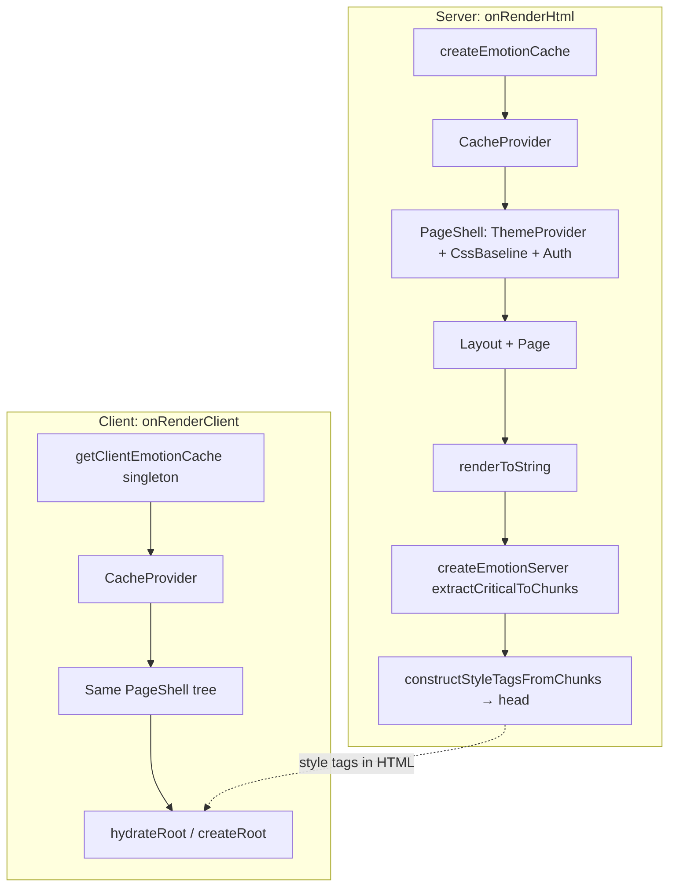

# MUI + Emotion SSR on Vike — engineering artifact

This document is the **single reference** for how Comunidad Dezzpo wires Material UI v6, Emotion, and Vike SSR. Use it when debugging FOUC, hydration warnings, or dependency upgrades.

## Goals

- Server HTML includes **Emotion critical CSS** so MUI `sx` and component styles paint correctly on first load.
- Client **hydrates** with the same Emotion cache key as the server (no duplicate style sheets).
- **One** MUI theme and baseline for marketing, app, and admin (`PageShell`).

## Architecture



### Head order (cascade)

Bootstrap CDN is linked **before** Emotion’s `<style>` injection so MUI/Emotion rules loaded in `<head>` can override Bootstrap where both apply. See `pages/+onRenderHtml.tsx`.

## Source map

| Piece | Path | Role |
|-------|------|------|
| Emotion cache factory | `src/emotion/createEmotionCache.ts` | Stable `key: 'mui'`, `prepend: true`; browser singleton via `getClientEmotionCache()`. |
| SSR HTML | `pages/+onRenderHtml.tsx` | Per-request cache, `renderToString`, extract chunks, inject tags, `emotionChunks.html` as `#root` body. |
| CSR / hydration | `pages/+onRenderClient.tsx` | Wraps with `CacheProvider` + same `PageShell` shape. |
| Theme / global providers | `pages/PageShell.tsx` | `ThemeProvider`, `CssBaseline`, `UserAuthProvider`, `PageContextProvider`. |
| Vite SSR deps | `vite.config.ts` → `ssr.noExternal` | **Production:** includes `@mui/*`, `@emotion/*`, Data Grid, Sendbird, `firebase`, etc., so Vite prebundles them for SSR. Omitting MUI/Emotion breaks Vercel with Node ESM `Directory import ... formatMuiErrorMessage` errors. |
| Node server + Vercel | `pages/+server.ts` + `vite-plugin-vercel` | Hono app: register API routes **before** `vike(app)`. After `vike build`, run locally with `vike preview` (`pnpm prod`) or deploy via Vercel ([Vike +server](https://vike.dev/server), [Vike > Vercel](https://vike.dev/vercel)). |
| MUI system pin | `package.json` → `pnpm.overrides` | `"@mui/system": "6.5.0"` keeps alignment with MUI v6 while using `@mui/x-data-grid` v7. |

## Completed implementation steps (1–5)

1. **Emotion cache helper** — shared key, `prepend`, client singleton.
2. **`+onRenderHtml`** — `CacheProvider` + `createEmotionServer`, critical CSS into `<head>`.
3. **`+onRenderClient`** — matching `CacheProvider` + `getClientEmotionCache()`.
4. **Theme consolidation** — `ThemeProvider` / `CssBaseline` / auth only in `PageShell`; app and admin layouts do not duplicate them.
5. **SSR coverage** — former CSR-only “escape hatch” paths removed so they participate in normal SSR when enabled.

## Step 6 — verification, hardening, and how to continue

Implementation steps 1–5 are done. **Step 6** is about **proving** the stack in real environments and **deciding** optional follow-ups (not another big code move unless something fails).

### A. Automated checks (every PR that touches UI or Vike)

```bash
pnpm typecheck
NODE_OPTIONS=--max-old-space-size=8192 pnpm build
pnpm why @mui/system   # expect a single 6.5.x line while on MUI v6 + override
```

### B. Manual SSR smoke checks

1. Run `pnpm dev` or `pnpm preview` after a production build.
2. **View source** (not only Elements) on a marketing URL and a hybrid `/app/...` URL:
   - Confirm `<head>` contains Emotion-generated `<style data-emotion="...">` blocks after the Bootstrap `<link>`.
   - Confirm `#root` contains server markup (not empty on SSR-enabled pages).
3. Hard refresh and watch for **FOUC** or wrong typography; compare with client-only navigation.

### C. If SSR breaks after upgrading Vite, Node, or MUI

Keep **`@mui/material`**, **`@mui/system`**, **`@mui/utils`**, **`@mui/icons-material`**, **`@mui/x-data-grid`**, **`@emotion/react`**, **`@emotion/styled`**, and **`@emotion/cache`** in production `ssr.noExternal`. Dropping them commonly reproduces Vercel/Node errors such as unsupported directory imports under `@mui/utils/formatMuiErrorMessage`.

If new resolution issues appear after upgrades, see [Vite `ssr.noExternal`](https://vite.dev/config/ssr-options.html#ssr-noexternal) and [MUI server rendering](https://mui.com/material-ui/guides/server-rendering/).

### D. Deferred: MUI v9 + Data Grid v9

Treat as a **separate migration project** (Grid v2, system props on `sx`, icons/slots, codemods). Do not bump `@mui/*` to v9 in the same change as SSR tweaks.

### E. Rollup circular chunk warnings (drafts / Firebase)

If the build warns that `draftService` exports are re-exported through `src/services/drafts/index.ts` while both end up in different chunks, import draft helpers **directly** from `@services/drafts/draftService` in pages and in `sendbird.service.ts`. Likewise, prefer `@services/firebase/authService` over `@services/firebase` for auth functions when the barrel re-export triggers chunk cycles with Sendbird.

### F. Optional polish

- Gate or remove verbose `[SSR]` `console.log` in `+onRenderHtml` for production logs.
- Add a small Playwright (or similar) assertion that `data-emotion` exists in saved HTML for a prerendered marketing route.

## Agent context

- Repository rules and boundaries: **`AGENTS.md`** (root) and route-group **`AGENTS.md`** under `pages/(marketing)/`, `pages/(app)/`, and `pages/admin/`.
- **Server / Vercel / Vite**: [`docs/server-stack-vike.md`](./server-stack-vike.md).
